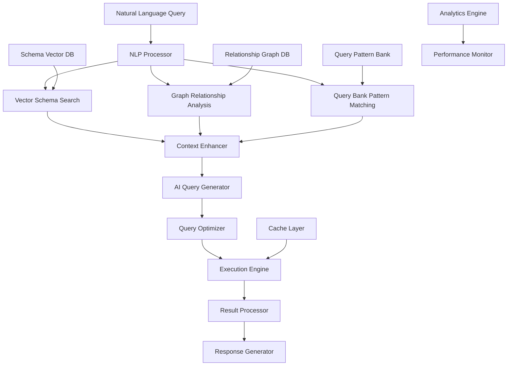

# Loom4 MySQL MCP Server

A Model Context Protocol (MCP) implementation that enables secure interaction with MySQL databases for the Loom4 platform. This server provides multiple interfaces including traditional MCP protocol, HTTP REST API, real-time streaming, and WebSocket communication for comprehensive database interaction and analysis.

## 🚀 Quick Start

### Local Development Setup
```bash
# Navigate to project directory
cd mcp-mysql

# Create and activate virtual environment
python -m venv venv
source venv/bin/activate  # or `venv\Scripts\activate` on Windows

# Install dependencies
pip install -r requirements.txt

# Start standalone streaming server (Recommended)
python standalone_server.py --host 0.0.0.0 --port 8001 --reload

# Or start HTTP wrapper server (for legacy Loom4 backend integration)
uvicorn http_wrapper:app --reload --port 8001

# Or start native MCP server (for direct MCP protocol communication)
python -m mysql_mcp_server
```

### Environment Configuration
Create a `.env` file in the project root:
```bash
MYSQL_HOST=127.0.0.1
MYSQL_PORT=3306
MYSQL_USER=your_username
MYSQL_PASSWORD=your_password
MYSQL_DATABASE=your_database
```

## ✨ Features

### Core Functionality

- 🗄️ **Database Resources** - List and explore MySQL tables as MCP resources
- 📊 **Table Content Reading** - Read and analyze table data
- 🔍 **SQL Query Execution** - Execute SQL queries with proper error handling
- 🛡️ **Secure Access** - Environment-based database configuration
- 📝 **Comprehensive Logging** - Detailed operation logging for debugging

### Multiple Interface Support

- 📡 **HTTP REST API** - Traditional request/response for simple operations
- ⚡ **Server-Sent Events (SSE)** - Real-time streaming for long-running queries
- 🔌 **WebSocket** - Bi-directional real-time communication
- 🧩 **MCP Protocol** - Native Model Context Protocol support
- 🔄 **Legacy Compatibility** - Backward compatible with existing HTTP wrapper

### Advanced AI Features

- 🧠 **Intelligent Query Generation** - AI-powered natural language to SQL conversion
- 📊 **Schema Analysis** - Automatic relationship detection and join path generation
- 🎯 **Context-Aware Queries** - Multi-table query optimization with relationship mapping
- 💡 **Error Guidance** - Intelligent suggestions for query improvements
- 🚀 **Performance Optimization** - Query complexity analysis and caching

## 🛠️ Installation & Setup

### For Loom4 Development
```bash
# Clone from Loom4 project
git clone <repository-url>
cd mcp-mysql

# Install dependencies
pip install -r requirements.txt
pip install -r requirements-dev.txt

# Install in editable mode for development
pip install -e .
```

### Standalone Installation
```bash
pip install mysql-mcp-server
```

## 🔧 Usage

### Standalone Streaming Server (Recommended)

**Full-Featured Streaming Server**:

```bash
# Start standalone server with all interfaces
python standalone_server.py --host 0.0.0.0 --port 8001 --reload

# Or use the startup script
python start_standalone.py
```

This provides comprehensive API interfaces at `http://127.0.0.1:8001`:

**Core Endpoints:**
- `GET /` - Server information and documentation
- `GET /health` - Health check with database connectivity
- `GET /docs` - OpenAPI/Swagger documentation
- `GET /info` - Detailed server status

**Database Operations:**
- `POST /database/question` - Natural language database queries
- `POST /database/question/stream` - Streaming natural language queries (SSE)
- `POST /sql/execute` - Direct SQL execution
- `POST /sql/stream` - Streaming SQL execution (SSE)

**Real-time Communication:**
- `WebSocket /ws` - Bi-directional real-time communication
- Connection parameters: `?client_id=your-client&user_id=user123`

### Legacy HTTP Wrapper Mode

**For existing Loom4 backend integration**:

```bash
# Start HTTP wrapper server
uvicorn http_wrapper:app --reload --port 8001
```

Provides backward-compatible endpoints:
- `POST /mcp/tools/call` - Execute SQL queries and MCP tools
- `GET /mcp/resources` - List database resources
- `POST /query/intelligent` - AI-powered intelligent querying

**Example API usage:**

```python
import requests

# Execute SQL query
response = requests.post("http://127.0.0.1:8001/mcp/tools/call", json={
    "name": "execute_sql",
    "arguments": {"query": "SELECT * FROM users LIMIT 10"}
})

# Intelligent query
response = requests.post("http://127.0.0.1:8001/query/intelligent", json={
    "question": "How many users registered this month?",
    "user_context": {"department": "analytics"}
})
```

### Native MCP Server Mode

For direct MCP protocol communication:

```bash
python -m mysql_mcp_server
```

### With Claude Desktop

Add this to your `claude_desktop_config.json`:

```json
{
  "mcpServers": {
    "mysql": {
      "command": "python",
      "args": ["-m", "mysql_mcp_server"],
      "env": {
        "MYSQL_HOST": "localhost",
        "MYSQL_PORT": "3306",
        "MYSQL_USER": "your_username",
        "MYSQL_PASSWORD": "your_password",
        "MYSQL_DATABASE": "your_database"
      }
    }
  }
}
```

## 🧪 Development & Testing

### Development Setup

```bash
# Clone the Loom4 repository
git clone <repository-url>
cd loom4/mcp-mysql

# Create virtual environment
python -m venv venv
source venv/bin/activate  # or `venv\Scripts\activate` on Windows

# Install development dependencies
pip install -r requirements.txt
pip install -r requirements-dev.txt

# Install in editable mode
pip install -e .
```

### Running Tests

```bash
# Run all tests
pytest

# Run with verbose output
pytest -v

# Run with coverage
pytest --cov

# Run specific test file
pytest tests/test_server.py
```

### Code Quality

```bash
# Format code
black .

# Sort imports
isort .

# Type checking
mypy src/
```

## 🔒 Security Considerations

### Database Security

- ✅ **Never commit credentials** - Use environment variables only
- ✅ **Create dedicated MySQL user** with minimal required permissions
- ✅ **Never use root credentials** or administrative accounts
- ✅ **Restrict database access** to only necessary operations
- ✅ **Enable comprehensive logging** for audit purposes
- ✅ **Regular security reviews** of database access patterns

### Best Practices

1. **Principle of Least Privilege** - Grant only necessary database permissions
2. **Query Whitelisting** - Consider implementing query validation for production
3. **Connection Monitoring** - Monitor and log all database operations
4. **Environment Isolation** - Separate development, staging, and production databases
5. **Regular Audits** - Periodically review database access logs

### Example MySQL User Setup

```sql
-- Create dedicated user for MCP server
CREATE USER 'mcp_user'@'localhost' IDENTIFIED BY 'secure_password';

-- Grant minimal required permissions
GRANT SELECT, INSERT, UPDATE, DELETE ON your_database.* TO 'mcp_user'@'localhost';

-- Flush privileges
FLUSH PRIVILEGES;
```

## 📄 License

MIT License - see LICENSE file for details.

## 🤝 Contributing

1. Fork the repository
2. Create your feature branch (`git checkout -b feature/amazing-feature`)
3. Commit your changes (`git commit -m 'Add some amazing feature'`)
4. Push to the branch (`git push origin feature/amazing-feature`)
5. Open a Pull Request

## 🚀 Enhancement Roadmap

### Phase 1: Advanced Query Intelligence

#### 1.1 Vector Database Integration for Schema Storage

**Objective**: Enhance query generation with semantic schema understanding using vector embeddings.

**Implementation Strategy**:
- **Vector Store**: Use ChromaDB, Pinecone, or Weaviate for schema embeddings
- **Schema Vectorization**: Convert table schemas, relationships, and sample data into embeddings
- **Semantic Search**: Find relevant tables/columns based on natural language queries
- **Context Enhancement**: Augment query generation with semantically similar schema elements

**Technical Components**:
```python
class VectorSchemaStore:
    def embed_schema(self, schema_info: dict) -> str:
        """Convert schema to embeddings for semantic search"""

    def semantic_search(self, question: str, top_k: int = 5) -> List[dict]:
        """Find most relevant schema elements for query"""

    def enhance_context(self, query_context: str, semantic_matches: List[dict]) -> str:
        """Augment query context with semantic schema information"""
```

**Benefits**:
- 🎯 Better table/column selection for ambiguous queries
- 📊 Improved understanding of data relationships
- 🧠 Contextual awareness across database schema
- ⚡ Faster query generation with relevant schema focus

#### 1.2 Graph Database for Relationship Mapping

**Objective**: Model database relationships as a graph for enhanced multi-table query generation.

**Implementation Strategy**:
- **Graph Store**: Neo4j, ArangoDB, or NetworkX for relationship modeling
- **Relationship Discovery**: Automated foreign key and semantic relationship detection
- **Path Finding**: Optimal join path calculation between tables
- **Query Optimization**: Graph-informed query plan generation

**Technical Components**:
```python
class GraphSchemaAnalyzer:
    def build_relationship_graph(self, schema_data: dict) -> Graph:
        """Build graph representation of database relationships"""

    def find_join_paths(self, source_tables: List[str], target_tables: List[str]) -> List[Path]:
        """Calculate optimal join paths between table sets"""

    def suggest_related_tables(self, base_tables: List[str]) -> List[str]:
        """Recommend additional relevant tables based on graph analysis"""
```

**Benefits**:
- 🔗 Optimal join path calculation for complex queries
- 📈 Relationship strength scoring and ranking
- 🎯 Smart table recommendation for incomplete queries
- 🚀 Reduced query execution time through optimized joins

#### 1.3 Query Bank & Pattern Learning

**Objective**: Learn from successful queries to improve future query generation.

**Implementation Strategy**:
- **Query Repository**: Store successful natural language → SQL mappings
- **Pattern Recognition**: Identify common query patterns and structures
- **Template Generation**: Create reusable query templates
- **Continuous Learning**: Improve suggestions based on usage patterns

**Technical Components**:
```python
class QueryBankService:
    def store_successful_query(self, nl_query: str, sql_query: str, metadata: dict):
        """Store successful query mappings for learning"""

    def find_similar_queries(self, question: str, similarity_threshold: float = 0.8) -> List[dict]:
        """Find similar historical queries for pattern matching"""

    def generate_query_templates(self, query_patterns: List[dict]) -> List[Template]:
        """Create reusable templates from successful queries"""
```

**Benefits**:
- 📚 Learning from historical query success patterns
- ⚡ Faster query generation using proven templates
- 🎯 Higher accuracy through pattern matching
- 📊 Continuous improvement of query quality

### Phase 2: Performance & Scalability Enhancements

#### 2.1 Intelligent Caching System

**Multi-Level Caching Strategy**:
```python
class IntelligentCacheManager:
    def __init__(self):
        self.schema_cache = TTLCache(maxsize=1000, ttl=3600)  # 1 hour
        self.query_cache = LRUCache(maxsize=5000)
        self.result_cache = TTLCache(maxsize=10000, ttl=1800)  # 30 minutes

    def cache_query_plan(self, question: str, plan: dict, ttl: int = 3600):
        """Cache query execution plans"""

    def get_cached_result(self, query_hash: str) -> Optional[dict]:
        """Retrieve cached query results"""
```

#### 2.2 Distributed Processing

**Horizontal Scaling Architecture**:
- **Query Queue**: Redis/RabbitMQ for query task distribution
- **Worker Nodes**: Multiple server instances for parallel processing
- **Load Balancing**: Intelligent request routing based on query complexity
- **Result Aggregation**: Efficient handling of distributed query results

#### 2.3 Advanced Analytics Integration

**Real-time Analytics Pipeline**:
```python
class AnalyticsEngine:
    def track_query_performance(self, query_id: str, metrics: dict):
        """Monitor query execution metrics"""

    def analyze_usage_patterns(self) -> dict:
        """Generate insights on database usage patterns"""

    def suggest_optimizations(self, slow_queries: List[dict]) -> List[dict]:
        """Recommend database optimizations based on query patterns"""
```

### Phase 3: Advanced AI & ML Features

#### 3.1 Natural Language Processing Enhancement

**Advanced NLP Pipeline**:
- **Intent Recognition**: Better understanding of query intentions
- **Entity Extraction**: Automatic identification of database entities in natural language
- **Ambiguity Resolution**: Smart handling of ambiguous queries
- **Multi-language Support**: Support for queries in multiple languages

#### 3.2 Predictive Query Suggestions

**ML-Powered Recommendations**:
```python
class QuerySuggestionEngine:
    def suggest_follow_up_queries(self, current_query: str, results: dict) -> List[str]:
        """Suggest logical follow-up queries based on current results"""

    def predict_user_intent(self, partial_query: str) -> List[str]:
        """Predict and autocomplete user queries"""

    def recommend_data_exploration(self, user_context: dict) -> List[str]:
        """Suggest data exploration queries based on user role/context"""
```

#### 3.3 Automated Schema Evolution

**Smart Schema Adaptation**:
- **Change Detection**: Monitor schema changes and adapt automatically
- **Migration Assistance**: Help with query updates during schema changes
- **Version Control**: Track schema evolution and maintain query compatibility

### Phase 4: Enterprise Features

#### 4.1 Advanced Security & Compliance

**Security Enhancements**:
- **Query Audit Trail**: Comprehensive logging of all database operations
- **Role-Based Access**: Fine-grained permissions based on user roles
- **Data Masking**: Automatic PII protection in query results
- **Compliance Reporting**: GDPR, HIPAA, SOX compliance support

#### 4.2 Integration Ecosystem

**Enterprise Integrations**:
- **BI Tools**: Direct integration with Tableau, PowerBI, Looker
- **Data Catalogs**: Integration with Apache Atlas, DataHub
- **Workflow Automation**: Zapier, Microsoft Power Automate connectors
- **Monitoring**: Integration with Datadog, New Relic, Prometheus

#### 4.3 Advanced Administration

**Management Features**:
```python
class EnterpriseAdminConsole:
    def manage_user_permissions(self, user_id: str, permissions: dict):
        """Manage fine-grained user access controls"""

    def configure_data_retention(self, table: str, retention_policy: dict):
        """Set up automated data lifecycle management"""

    def setup_disaster_recovery(self, backup_config: dict):
        """Configure automated backup and recovery procedures"""
```

### Implementation Timeline

**Phase 1** (Q1 2024): Vector DB + Graph DB + Query Bank
- 🎯 Focus: Enhanced query intelligence
- 📊 Expected Impact: 40% improvement in query accuracy
- ⚡ Timeline: 3-4 months

**Phase 2** (Q2 2024): Performance & Scalability
- 🎯 Focus: Production-ready scaling
- 📊 Expected Impact: 10x performance improvement
- ⚡ Timeline: 2-3 months

**Phase 3** (Q3 2024): Advanced AI/ML
- 🎯 Focus: Intelligent automation
- 📊 Expected Impact: 60% reduction in manual query writing
- ⚡ Timeline: 4-5 months

**Phase 4** (Q4 2024): Enterprise Features
- 🎯 Focus: Enterprise adoption
- 📊 Expected Impact: Full enterprise compliance
- ⚡ Timeline: 3-4 months

### Technical Architecture



This roadmap transforms the MySQL MCP Server from a simple database interface into an intelligent, enterprise-grade database interaction platform with advanced AI capabilities, comprehensive caching, and production-ready scalability.

## 📞 Support

For Loom4-specific issues and integration support, please refer to the main Loom4 documentation or contact the development team.

For streaming server documentation, see [README_STREAMING.md](README_STREAMING.md).
